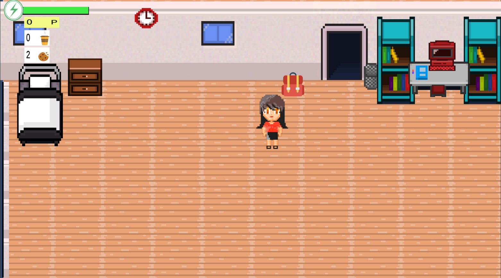
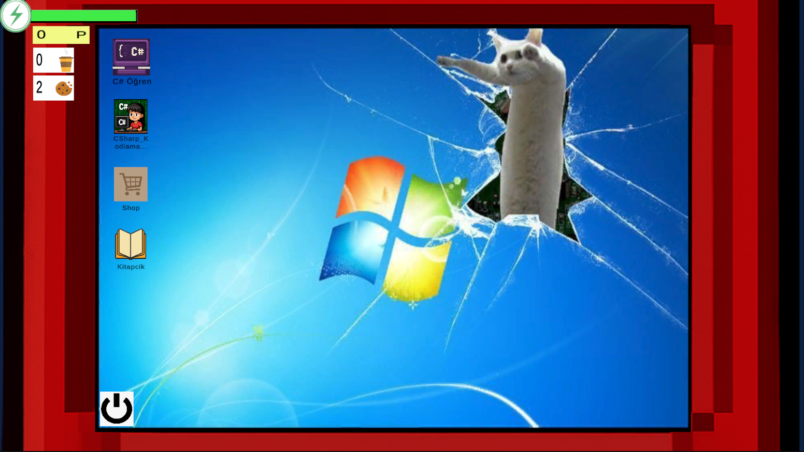
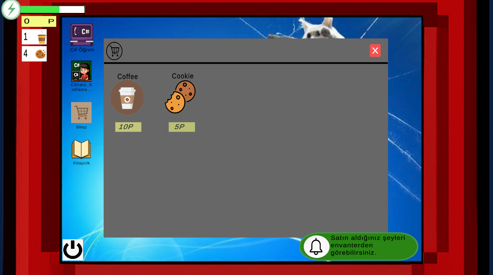

# C# Kodlama Görevleri Oyunu

## 💻 Proje Hakkında
Bu proje, oyunculara **Unity içinde gerçek C# kodları yazdırarak** programlama mantığını öğretmeyi amaçlayan interaktif bir simülasyon oyunudur. Klasik eğitim metotlarının aksine, oyuncu oyun içerisindeki görevleri tamamlamak için doğru sözdizimi (syntax) ile kod yazmalıdır.

Sadece kod yazmaya değil, aynı zamanda stratejik kaynak yönetimine de odaklanır; oyuncu her kod yazdığında **Enerji (Energy)** harcar, bu da oyuncuyu daha dikkatli ve optimize kod yazmaya teşvik eder.

### Temel Özellikler
* **Gerçek Zamanlı Kod Girişi:** Oyun içi input alanlarına gerçek C# komutları (örn. `int`, `if/else`) yazılabilir.
* **Enerji Mekaniği:** Kod yazmak enerji tüketir. Enerji bittiğinde oyuncunun görevlerden kazandığı puanlarla enerji alması gerekir.
* **Seviye Sistemi:** Basit değişkenlerden başlayıp daha karmaşık yapılara kadar artan zorluk seviyesi.

## Nasıl Oynanır?
1.  Oyun içi editörü aç ve gerekli C# kodunu yaz.
2.  **"Compile" (Derle)** butonuna bas.
3.  Kod doğruysa yeni bölüme geçilir, hatalıysa hata mesajı döner.
4.  Enerjini bitirirsen uyuyarak veya kahve içerek enerjini tamamlayabilirsin!

## 🛠️ Teknik Detaylar
Bu projede Unity'nin standart UI sistemleri ve C# string işleme fonksiyonları yoğun olarak kullanılmıştır.

* **Oyun Motoru:** Unity
* **Dil:** C#
* **UI:** Unity UI (Canvas, Input Fields)
* Game Manager (Enerji ve Level yönetimi)

## 📷 Ekran Görüntüleri

| Ana Arayüz | Bilgisayar Arayüzü |
| :---: | :---: |
|  |  |
| **Enerji Sistemi** | **Editör Arayüzü** |
|  |  |
---
*Geliştirici: [Esin Tekin]*
